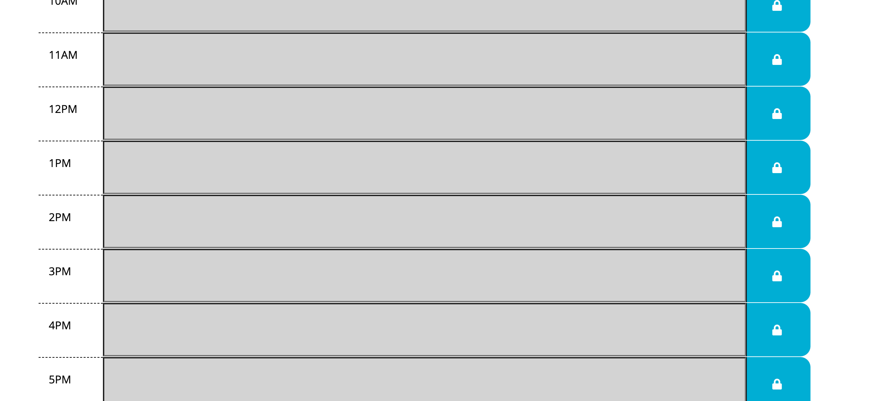

For this assignment I was tasked with creating a workday scheduler using moment. Tasks can be added to the page and saved within the local storage, while the colors of the time blocks change according to what time it is on the users device.

https://ethanfregien2233.github.io/workday-scheduler2/
https://github.com/ethanfregien2233/workday-scheduler2

